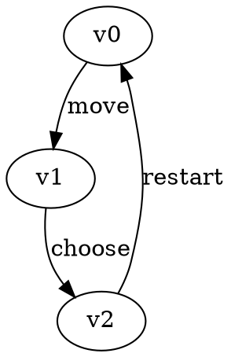
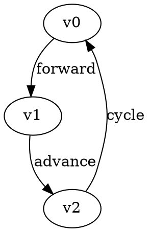

# File Formats {#file_formats}

Game Graph Gym supports reading and writing game graphs in [Graphviz DOT](https://graphviz.org/doc/info/lang.html) format with custom attributes for different game types.

## Common Format Elements

All game graph types share these common elements:

### Vertex Attributes

- `name` (string): Human-readable vertex identifier
- `player` (int): Owning player (0 or 1)

### Edge Attributes  

- `label` (string): Human-readable edge label

## Game-Specific Formats

### Parity Games

Parity games add the following vertex attribute:

- `priority` (int): Priority value for parity condition

**Example:**



### Mean-Payoff Games

Mean-payoff games add the following vertex attribute:

- `weight` (int): Weight value for mean-payoff calculation

**Example:**



### Büchi Games

Büchi games use the common format with additional semantic interpretation:

- Accepting vertices are typically marked with specific priorities or names
- The exact acceptance condition depends on the specific variant


## Parser Usage

All parsers follow the same interface pattern, using free functions:

```cpp
#include <libggg/parity/graph.hpp>

// Parse from file
auto game = ggg::parity::graph::parse("game.dot");

// Parse from stream
#include <fstream>
std::ifstream in("game.dot");
auto game2 = ggg::parity::graph::parse(in);
```

## Writing Games

Games can be written back to DOT format using the appropriate writer functions:

```cpp
#include <libggg/parity/graph.hpp>

ggg::parity::graph::write(*game, "output.dot");
```

## Validation

The parsers perform basic validation:

- Required attributes must be present
- Player values must be 0 or 1  
- Numeric attributes must be valid integers
- Graph structure must be well-formed

Invalid files will throw parsing exceptions with descriptive error messages.
