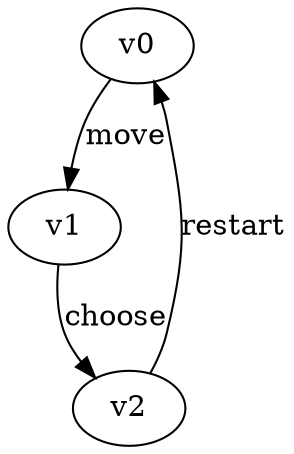

# Command-line tools {#tools}

GGG provides macros to define command-line tools with a uniform interface, input parsing and validation.

## Game solvers

### Input File Formats {#input_formats}

GGG provides parsing and writing game graphs in [Graphviz DOT](https://graphviz.org/doc/info/lang.html) format with custom attributes for the dynamic properties defined on the graph type.

For example, Parity games graphs have the following vertex attributes:

- `player` (int): owner of the vertex (can be 0 or 1)
- `priority` (int): Priority value for parity condition
  
It also interprets a `String` valued attribute called "label" on edges.  
The following is a valid input format for such a game graph

## Random Game Graph Generators

## Benchmarking Scripts