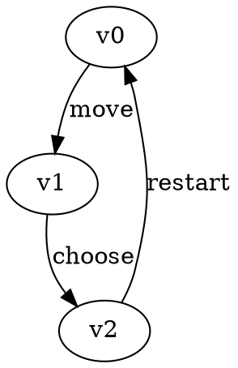
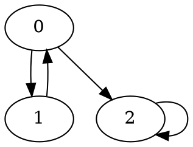
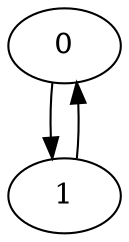
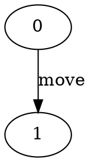
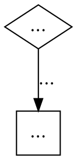

# Command-line tools {#tools}

GGG provides macros to define command-line tools with a uniform interface, input parsing and validation.

## Game solvers

The executables for game solvers are called `ggg_X_solver_Y`, where `X` identifies the game graph type and `Y` is the name of the algorithm. For instance, the "priority promotion" algorithm for solving Parity games is compiled into a binary  named `ggg_parity_solver_priority_promotion`.

All solver binaries are produced in `build/bin` and share a common CLI shape:

```text
ggg_<game>_solver_<algorithm> [options] <input>
```

Where `<input>` is required and can be:

- a file path to a DOT game graph, or
- `-` to read from stdin.

### Solver options and examples

- `-h, --help` show usage
- `-f, --format <plain|json>` output format (`plain` by default)
- `-t, --time-only` print only solving time
- `--solver-name` print solver name and exit
- `-v`, `-vv`, `-vvv` increase verbosity (when logging is enabled at build time)

Examples:

```bash
# Show solver help
./build/bin/ggg_parity_solver_recursive --help

# Print only the solver name
./build/bin/ggg_parity_solver_recursive --solver-name test.dot

# Solve a game in plain output (default)
./build/bin/ggg_parity_solver_recursive test.dot

# Solve with JSON output
./build/bin/ggg_parity_solver_recursive --format json test.dot

# Output only solving time
./build/bin/ggg_parity_solver_recursive --time-only test.dot

# Read game from stdin
cat test.dot | ./build/bin/ggg_parity_solver_recursive -

# Increase verbosity
./build/bin/ggg_parity_solver_recursive -vv test.dot
```

List available solvers by game type:

```bash
ls -1 build/bin/ggg_parity_solver_*
ls -1 build/bin/ggg_mean_payoff_solver_*
ls -1 build/bin/ggg_stochastic_discounted_solver_*
ls -1 build/bin/ggg_buechi_solver_*
```


### Input File Formats {#input_formats}

GGG provides parsing and writing game graphs in [Graphviz DOT](https://graphviz.org/doc/info/lang.html) format with custom attributes for the dynamic properties defined on the graph type.

For example, Parity games graphs have the following vertex attributes:

- `player` (int): owner of the vertex (can be 0 or 1)
- `priority` (int): Priority value for parity condition
  
It also interprets a `String` valued attribute called "label" on edges.  
The following is a valid input format for such a game graph



## Random Game Graph Generators

The executables for random game graph generators are called `ggg_X_generate`, where `X` identifies the game graph type. For instance, a generator for Parity game graphs is compiled into a binary named `ggg_parity_generate`.

Common options shared by generators:

- `-h, --help`
- `-o, --output-dir <dir>` output directory (default: `./generated`)
- `-c, --count <int>` number of games to generate
- `--seed <int>` deterministic random seed
- `--verbose` print generated file names

> Note: `ggg_buechi_generate` is currently not provided (Büchi has solver CLIs, no generator yet).

### Parity generator (`ggg_parity_generate`)

Additional options:

- `--vertices` number of vertices (default: `10`)
- `--max-priority` maximum priority (default: `5`)
- `--min-out-degree` minimum out-degree per vertex (default: `1`)
- `--max-out-degree` maximum out-degree per vertex (default: `-1`, interpreted as `vertices - 1`)

Useful aliases are also accepted (for compatibility): `-vx`, `-mp`, `-mo`, `-mxo`.

```bash
# Generate 10 parity games with 40 vertices each
./build/bin/ggg_parity_generate -o games/parity -c 10 --vertices 40

# Restrict priorities and out-degree range
./build/bin/ggg_parity_generate -o games/parity -c 5 --vertices 30 --max-priority 12 --min-out-degree 2 --max-out-degree 5
```

Output files follow the pattern: `parity_game_0.dot`, `parity_game_1.dot`, ...

### Mean-payoff generator (`ggg_mean_payoff_generate`)

Additional options:

- `--vertices` number of vertices (default: `10`)
- `--min-weight` minimum vertex weight (default: `-10`)
- `--max-weight` maximum vertex weight (default: `10`)
- `--min-out-degree` minimum out-degree per vertex (default: `1`)
- `--max-out-degree` maximum out-degree per vertex (default: `-1`, interpreted as `vertices - 1`)

Useful aliases are also accepted: `-vx`, `-mw`, `-mxw`, `-mo`, `-mxo`.

```bash
# Generate 20 mean-payoff games
./build/bin/ggg_mean_payoff_generate -o games/mpv -c 20 --vertices 60 --min-weight -20 --max-weight 20

# Keep branching factor moderate
./build/bin/ggg_mean_payoff_generate -o games/mpv -c 5 --vertices 80 --min-out-degree 2 --max-out-degree 4
```

Output files follow the pattern: `mpv_game_0.dot`, `mpv_game_1.dot`, ...

### Stochastic discounted generator (`ggg_stochastic_discounted_generate`)

Additional options:

- `--player-vertices` number of player-owned vertices (players 0/1)
- `--min-player-outgoing` minimum outgoing edges per player-owned vertex
- `--max-player-outgoing` maximum outgoing edges per player-owned vertex
- `--min-weight` minimum deterministic edge weight
- `--max-weight` maximum deterministic edge weight
- `--discount` discount factor, must satisfy `0 < discount < 1`

Useful aliases are also accepted: `-vx`, `-mo`, `-mxo`, `-mw`, `-mxw`, `-d`.

```bash
# Generate stochastic discounted games with default weight range and discount
./build/bin/ggg_stochastic_discounted_generate -o games/sd -c 8 --player-vertices 30 --min-player-outgoing 1 --max-player-outgoing 3

# Use custom reward range and discount factor
./build/bin/ggg_stochastic_discounted_generate -o games/sd -c 4 --player-vertices 25 --min-player-outgoing 2 --max-player-outgoing 4 --min-weight -5 --max-weight 15 --discount 0.9
```

Output files follow the pattern: `stochastic_discounted_game_0.dot`, `stochastic_discounted_game_1.dot`, ...

### End-to-end CLI workflow example

```bash
# 1) Generate parity games
./build/bin/ggg_parity_generate -o games/parity -c 3 --vertices 50 --max-priority 10

# 2) Solve one game in JSON
./build/bin/ggg_parity_solver_priority_promotion --format json games/parity/parity_game_0.dot

# 3) Compare with a second solver and print only time
./build/bin/ggg_parity_solver_recursive --time-only games/parity/parity_game_0.dot
```

## Benchmarking Scripts

GGG ships some convenience scripts in `/extra/scripts` to run and plot benchmarks and convert file formats.

Current scripts include:

- `benchmark.sh`
- `ggg_to_dot.py`
- `hoa_to_dot.py`
- `pgsolver_to_ggg.py`
- `plot_performance_by_game_type.py`
- `plot_time_by_game_index.py`
- `plot_time_by_vertex_count.py`

### Benchmark runner: `benchmark.sh`

The benchmark runner executes one or more solver binaries against a corpus of `.dot` games and writes a JSON results file.

System prerequisites for the shell runner: `bash`, `timeout` (coreutils), and `bc`.

Usage:

```bash
bash extra/scripts/benchmark.sh <games_dir> <solver_dir> [--time SECONDS] [-o OUTPUT_FILE] [--solver NAME]... [--solvers NAME1,NAME2,...]
```

Arguments:

- `<games_dir>`: directory containing game files
    - either flat (`games_dir/*.dot`), or
    - grouped by type (`games_dir/<type>/*.dot`)
- `<solver_dir>`: directory containing executable solver binaries (typically `build/bin`)

Options:

- `--time SECONDS`: timeout per solver/game pair (default: `300`)
- `-o, --output FILE`: output JSON file
- `--solver NAME`: pick one solver (repeatable)
- `--solvers NAME1,NAME2,...`: pick multiple solvers in one option

If no `--solver`/`--solvers` is provided, the script prompts interactively.

> Tip: if you pass `./build/bin` as `<solver_dir>`, prefer explicit `--solver`/`--solvers` so you only benchmark solver executables.

#### Working example 1: benchmark generated parity games

```bash
# 1) Generate a small corpus
./build/bin/ggg_parity_generate -o /tmp/ggg_games/parity -c 10 --vertices 50 --max-priority 10

# 2) Benchmark two parity solvers with a 60s timeout
bash extra/scripts/benchmark.sh \
    /tmp/ggg_games/parity \
    ./build/bin \
    --time 60 \
    --solvers ggg_parity_solver_recursive,ggg_parity_solver_priority_promotion \
    -o /tmp/ggg_parity_results.json
```

#### Working example 2: benchmark existing test-suite corpus

```bash
bash extra/scripts/benchmark.sh \
    ./tests/test-suites/parity \
    ./build/bin \
    --solver ggg_parity_solver_recursive \
    --solver ggg_parity_solver_progressive_small_progress_measures \
    -o /tmp/parity_suite_results.json
```

The output JSON is an array of records with fields such as:

- `solver`
- `game`
- `type` (present for type-based directory layouts)
- `status` (`success`, `timeout`, `failed`)
- `time` (seconds; timeout entries are set to the timeout value)
- `vertices`, `edges`, `timestamp`

Representative record:

```json
{
    "solver": "ggg_parity_solver_recursive",
    "game": "parity_game_0",
    "type": "parity",
    "status": "success",
    "time": 0.01342,
    "vertices": 50,
    "edges": 121,
    "timestamp": 1770000000
}
```

### Plotting benchmark output

The plotting scripts consume the JSON produced by `benchmark.sh`.

Prerequisites (Python):

```bash
python3 -m pip install matplotlib numpy pandas
```

#### 1) Time by game index

```bash
python3 extra/scripts/plot_time_by_game_index.py \
    /tmp/ggg_parity_results.json \
    --output-dir /tmp/ggg_plots \
    --title "Parity solvers: runtime by game index"
```

Output file:

- `/tmp/ggg_plots/individual_game_performance.png`

#### 2) Mean time by vertex count (scalability)

```bash
python3 extra/scripts/plot_time_by_vertex_count.py \
    /tmp/ggg_parity_results.json \
    --output-dir /tmp/ggg_plots \
    --title "Parity solvers: scalability by vertex count"
```

Output file:

- `/tmp/ggg_plots/scalability_by_vertex_count.png`

#### 3) Performance by game type

```bash
python3 extra/scripts/plot_performance_by_game_type.py /tmp/ggg_parity_results.json
```

Output file (saved next to the JSON input):

- `/tmp/game_type_performance.png` (if input is `/tmp/ggg_parity_results.json`)

This plot aggregates results by `(solver, game type)` and overlays timeout counts.

### Typical end-to-end workflow

```bash
# Generate games
./build/bin/ggg_parity_generate -o /tmp/bench_games -c 20 --vertices 100

# Benchmark
bash extra/scripts/benchmark.sh /tmp/bench_games ./build/bin \
    --solvers ggg_parity_solver_recursive,ggg_parity_solver_priority_promotion \
    --time 120 \
    -o /tmp/bench_results.json

# Produce all plots
python3 extra/scripts/plot_time_by_game_index.py /tmp/bench_results.json --output-dir /tmp/bench_plots
python3 extra/scripts/plot_time_by_vertex_count.py /tmp/bench_results.json --output-dir /tmp/bench_plots
python3 extra/scripts/plot_performance_by_game_type.py /tmp/bench_results.json
```

### Format conversion helpers

These scripts are useful when preparing benchmark corpora from external formats:

- `pgsolver_to_ggg.py`: convert pgsolver parity format to GGG DOT
- `hoa_to_dot.py`: convert HOA automata/parity-game-like inputs to DOT
- `ggg_to_dot.py`: transform GGG DOT attributes for Graphviz-friendly visualization

#### 1) `pgsolver_to_ggg.py`

Input format (pgsolver parity):

```text
parity 2;
0 1 0 1,2 "v0";
1 2 1 0 "v1";
2 0 0 2 "v2";
```

Converted output (GGG DOT):



Command example:

```bash
python3 extra/scripts/pgsolver_to_ggg.py input.pg -o output.dot --verify
```

Batch conversion example:

```bash
python3 extra/scripts/pgsolver_to_ggg.py ./pg_games -o ./dot_games --recursive --verify
```

#### 2) `hoa_to_dot.py`

HOA stands for **Hanoi Omega-Automata format**. It is an external interchange format from the ω-automata/model-checking ecosystem (not specific to GGG). You will typically encounter `.hoa`/`.ehoa` files when exporting automata or game-like structures from tools such as Spot and related LTL/automata toolchains.

Converter capabilities:

- single-file conversion and directory batch conversion
- recursive traversal with `--recursive`
- extension filtering with `--input-exts`
- optional semantic checks with `--verify`
- internal smoke test with `--self-test`
- supports state-based acceptance, transition-based acceptance, and generalized-Büchi HOA inputs

Input format (HOA, state-acceptance style):

```text
HOA: v1
States: 2
Start: 0
acc-name: parity min even 2
Acceptance: 2 Inf(0) & Fin(1)
--BODY--
State: 0 "s0" {1}
[0] 1
State: 1 "s1" {0}
[0] 0
--END--
```

Converted output (DOT):



Command examples:

```bash
# single file
python3 extra/scripts/hoa_to_dot.py game.hoa -o game.dot

# directory batch conversion
python3 extra/scripts/hoa_to_dot.py ./hoa_games -o ./dot_games --recursive
```

#### 3) `ggg_to_dot.py`

This script takes valid GGG DOT and rewrites labels/styles for visualization.

I/O behavior:

- reads from the file path argument (or stdin when omitted / `-`)
- writes transformed DOT to stdout (redirect with `>`)

Typical GGG DOT input:



Representative transformed DOT output (Graphviz-friendly labels/shapes):



Command example:

```bash
python3 extra/scripts/ggg_to_dot.py input.dot > visual.dot
```

### Troubleshooting

#### `benchmark.sh` fails with `timeout: command not found`

Cause: GNU coreutils `timeout` is missing.

Fix: install coreutils for your platform, then re-run the benchmark command.

#### `benchmark.sh` fails with `bc: command not found`

Cause: the script uses `bc` to compute elapsed wall-clock time.

Fix: install `bc`, then re-run.

#### `No executable solvers found in <solver_dir>`

Cause: wrong directory passed as `<solver_dir>`, or tools/solvers are not built yet.

Fixes:

- ensure binaries exist under `build/bin`
- configure/build with tool families enabled (for example `-DTOOLS_ALL=ON`)
- pass the correct solver directory path

#### Benchmarks unexpectedly include non-solver binaries

Cause: `benchmark.sh` scans executable files in `<solver_dir>`.

Fix: always pass explicit `--solver`/`--solvers` names to restrict selection.

#### `No .dot files` / empty result set

Cause: input corpus path is wrong, file extension does not match, or directory structure is unexpected.

Fixes:

- verify the game path contains `.dot` files
- check whether your corpus is flat (`dir/*.dot`) or grouped (`dir/type/*.dot`)
- for conversion pipelines, confirm output files were written to the expected directory

#### Plot scripts fail with Python import errors

Cause: missing plotting dependencies.

Fix:

```bash
python3 -m pip install matplotlib numpy pandas
```

#### Plot scripts run, but no curves appear

Cause: many plot scripts only use successful benchmark entries (`status == success`).

Fixes:

- inspect the JSON and confirm successful rows exist
- increase benchmark timeout to reduce `timeout` statuses
- verify selected solver names are correct and runnable

#### Conversion script processes no files in directory mode

Cause: input extension filter does not match your files.

Fix: pass `--input-exts` explicitly, for example:

```bash
python3 extra/scripts/hoa_to_dot.py ./hoa_games -o ./dot_games --recursive --input-exts .hoa,.ehoa
python3 extra/scripts/pgsolver_to_ggg.py ./pg_games -o ./dot_games --recursive --input-exts .pg,.pgsolver,.gm
```

#### `ggg_to_dot.py` appears to produce no output file

Cause: the script writes to stdout by design.

Fix: redirect output explicitly (for example `> visual.dot`).
